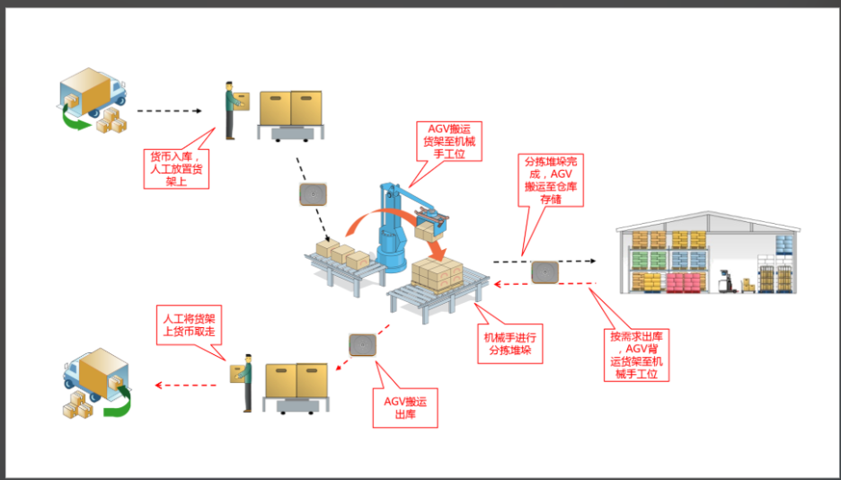

原因： FastAPI 有一套默认逻辑——如果参数是一个 BaseModel 类型，它会自动认为这是 JSON Body。
但 GET 请求协议规范中是不推荐（甚至很多服务器不支持）带 Body 的。
通过引入 fastapi.Depends，你改变了 FastAPI 解析数据的方式：
from fastapi import Depends

@app.get("/users")
async def get_users(params: UserParams = Depends()):  # ✅ 填坑成功！
    return params

方式一
response_model可以自动匹配你的类定义的字段和效验
@app.get("/user/me", response_model=UserSchemas)
async def get_me():
    # 假设数据库里查出的对象只有 first_name 和 last_name
    user_obj = {"first_name": "张", "last_name": "三"} 
    
    # 直接返回，FastAPI 序列化时会自动加上 "full_name": "张 三"
    return user_obj

方式二
@router.get('/user/me')
async def get_me(user_query: UserParams = Depends()):
    # 1. 数据库查询拿到对象
    user_obj = await User.get(id=1)
    # 2. 【核心步骤】使用 Pydantic 进行校验和转换
    # 这一步会触发你写的手机号正则校验和脱敏逻辑
    user_data = UserSchemas.model_validate(user_obj).model_dump()
    
    # 3. 使用你写的 APIResponse 返回
    return APIResponse(result=user_data)

#反向查询
#获取集合对象
location = WMSLocation.filter(start_code= location_code)
#查询另一个表的数据信息
location.missions_out.filter(status=1).all()

智能仓库

